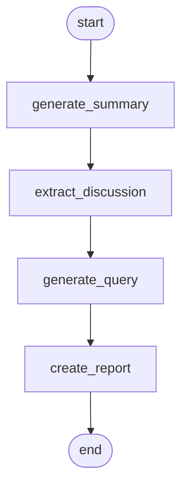

# Slack Journal Agent

LangChainとLangGraphを使用して、Slackのログを分析し、要約レポートを生成・配信するエージェントです。

## 機能

- Slackログの要約生成
- 重要なディスカッションポイントの抽出
- リサーチクエリの生成
- レポートの作成とSlackへの配信

## アーキテクチャ

### グラフ構造



### コンポーネント

- `SummaryGenerator`: Slackログから要約を生成
- `DiscussionExtractor`: 要約から重要なディスカッションポイントを抽出
- `QueryGenerator`: ディスカッションポイントからリサーチクエリを生成
- `JournalAnalysisGraph`: 全体のワークフローを管理

## セットアップ

1. 必要な環境変数を設定
```bash
cp .env.example .env
```

2. `.env`ファイルを編集
```
GOOGLE_API_KEY=your_gemini_api_key
SLACK_WEBHOOK_URL=your_slack_webhook_url
```

3. 依存パッケージのインストール
```bash
pip install -r requirements.txt
```

## 使用方法

```bash
python main.py
```

## ディレクトリ構造

```
.
├── main.py                 # エントリーポイント
├── src/
│   ├── config.py          # 設定管理
│   ├── journal_analysis_graph.py  # メインのグラフ実装
│   ├── states.py          # 状態管理の型定義
│   ├── models/            # データモデル
│   │   └── states.py      # 状態管理のモデル定義
│   ├── nodes/             # グラフのノード
│   │   ├── summary_generator.py      # 要約生成
│   │   ├── discussion_extractor.py   # ディスカッションポイント抽出
│   │   └── query_generator.py        # リサーチクエリ生成
│   └── utils/             # ユーティリティ
│       ├── file_handler.py  # ファイル操作
│       └── slack.py         # Slack連携
├── data/                  # サンプルデータ
│   └── sample_log.txt     # サンプルのSlackログ
└── outputs/               # 生成されたファイル
    ├── summaries/         # 要約
    ├── discussion_points/ # ディスカッションポイント
    ├── queries/          # リサーチクエリ
    └── reports/          # 最終レポート
```

## 出力ファイル

- `outputs/summaries/`: 生成された要約（Markdown形式）
- `outputs/discussion_points/`: 抽出されたディスカッションポイント（JSON形式）
- `outputs/queries/`: 生成されたリサーチクエリ（JSON形式）
- `outputs/reports/`: 最終レポート（Markdown形式）

## 開発環境

- Python 3.11+
- LangChain
- LangGraph
- Gemini-1.5-pro

## ライセンス

MIT