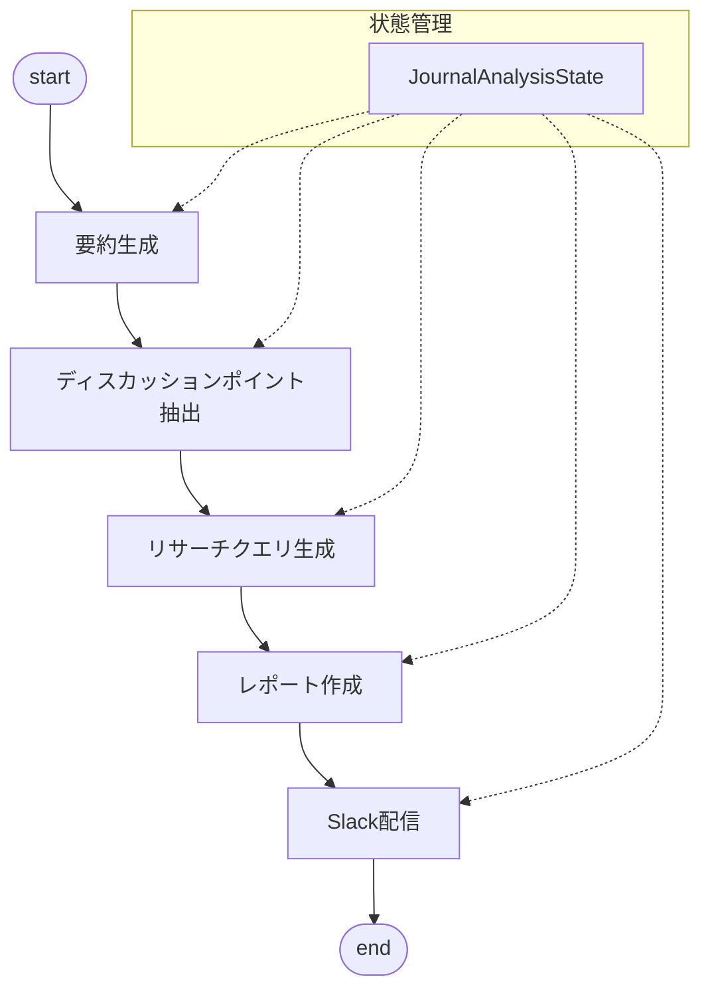

# Slack Journal Agent

LangChainとLangGraphを使用して、Slackのログを分析し、要約レポートを生成・配信するエージェントです。

## 機能

- Slackログの要約生成
- 重要なディスカッションポイントの抽出
- リサーチクエリの生成
- レポートの作成とSlackへの配信

## アーキテクチャ

### 技術スタック

- **LLM**: Vertex AI (Gemini-1.5-pro)
  - 高度な自然言語処理能力
  - 長いコンテキスト（約100Kトークン）のサポート
  - 構造化出力の生成

- **フレームワーク**:
  - LangChain: LLMの操作と統合
  - LangGraph: ワークフローの制御
  - Pydantic: データのバリデーションと構造化

### グラフ構造



### コンポーネント

#### ノード
- `SummaryGenerator`: 
  - Slackログから重要な議論を抽出し、構造化された要約を生成
  - Markdown形式で出力

- `DiscussionExtractor`:
  - 要約から重要なディスカッションポイントを抽出
  - Pydanticモデル（`DiscussionPoints`）で構造化

- `QueryGenerator`:
  - ディスカッションポイントから英語のリサーチクエリを生成
  - Pydanticモデル（`ResearchQueries`）で構造化

#### 状態管理
- `JournalAnalysisState` (TypedDict):
  - 入力: Slackログテキスト
  - 中間状態: 要約、ディスカッションポイント、クエリ
  - 出力: レポートファイルパス、Slack配信状態

#### ユーティリティ
- `file_handler`: ファイル操作（JSON、Markdown）
- `slack`: Slack Webhook連携

### データフロー

1. 入力
   - Slackログ（テキスト）

2. 処理フロー
   - ログ → 要約（Markdown）
   - 要約 → ディスカッションポイント（JSON）
   - ディスカッションポイント → リサーチクエリ（JSON）
   - 全データ → 最終レポート（Markdown）

3. 出力
   - ファイル出力（各段階の結果）
   - Slack配信（最終レポート）

## セットアップ

1. 必要な環境変数を設定
```bash
cp .env.example .env
```

2. `.env`ファイルを編集
```
# Vertex AI
GOOGLE_CLOUD_PROJECT=your_project_id
GOOGLE_CLOUD_LOCATION=us-central1
GOOGLE_APPLICATION_CREDENTIALS=path/to/your/service-account-key.json

# LangSmith（オプション）
LANGCHAIN_TRACING_V2=true
LANGCHAIN_ENDPOINT=https://api.smith.langchain.com
LANGCHAIN_API_KEY=your_langsmith_api_key
LANGCHAIN_PROJECT=your_project_name

# Slack
SLACK_WEBHOOK_URL=your_slack_webhook_url

# その他
TAVILY_API_KEY=your_tavily_api_key
```

3. 依存パッケージのインストール
```bash
pip install -r requirements.txt
```

4. サービスアカウントキーの設定
- Google Cloud Consoleでサービスアカウントを作成
- Vertex AI APIの権限を付与
- JSONキーをダウンロードし、プロジェクトルートに配置
- `.env`の`GOOGLE_APPLICATION_CREDENTIALS`にパスを設定

## 使用方法

1. サンプルデータの準備
```bash
# dataディレクトリにSlackログを配置
cp your_slack_log.txt data/sample_log.txt
```

2. 実行
```bash
python main.py
```

## テスト実行

1. テストデータの準備
```bash
# サンプルのSlackログをdataディレクトリに配置
cp tests/data/test_log.txt data/sample_log.txt
```

2. 動作テストの実行
```bash
# 基本的な動作テスト
python main.py

# デバッグモードでの実行（詳細なログ出力）
DEBUG=true python main.py
```

3. テスト結果の確認
- `outputs/summaries/`: 生成された要約の確認
- `outputs/discussion_points/`: 抽出されたディスカッションポイントの確認
- `outputs/queries/`: 生成されたリサーチクエリの確認
- `outputs/reports/`: 最終レポートの確認
- Slackに投稿されたメッセージの確認

## ディレクトリ構造

```
.
├── main.py                 # エントリーポイント
├── src/
│   ├── config.py          # 設定管理
│   ├── journal_analysis_graph.py  # メインのグラフ実装
│   ├── states.py          # 状態管理の型定義
│   ├── models/            # データモデル
│   │   └── states.py      # 状態管理のモデル定義
│   ├── nodes/             # グラフのノード
│   │   ├── summary_generator.py      # 要約生成
│   │   ├── discussion_extractor.py   # ディスカッションポイント抽出
│   │   └── query_generator.py        # リサーチクエリ生成
│   └── utils/             # ユーティリティ
│       ├── file_handler.py  # ファイル操作
│       └── slack.py         # Slack連携
├── data/                  # 入力データ
│   └── .gitkeep          # 空ディレクトリの維持用
├── tests/                # テストコード（今後追加予定）
│   └── data/            # テストデータ
└── outputs/              # 生成されたファイル
    ├── summaries/        # 要約
    ├── discussion_points/ # ディスカッションポイント
    ├── queries/          # リサーチクエリ
    └── reports/          # 最終レポート
```

## 注意事項

1. セキュリティ
- サービスアカウントキーは`.gitignore`に含め、リポジトリにコミットしない
- 環境変数ファイル（.env）も同様にコミットしない

2. データ管理
- `data/`ディレクトリには実際のSlackログを配置
- サンプルデータは`tests/data/`に保存
- 機密情報を含むログは`.gitignore`で管理

## 開発環境

- Python 3.11+
- LangChain
- LangGraph
- Vertex AI (Gemini-1.5-pro)

## ライセンス

MIT